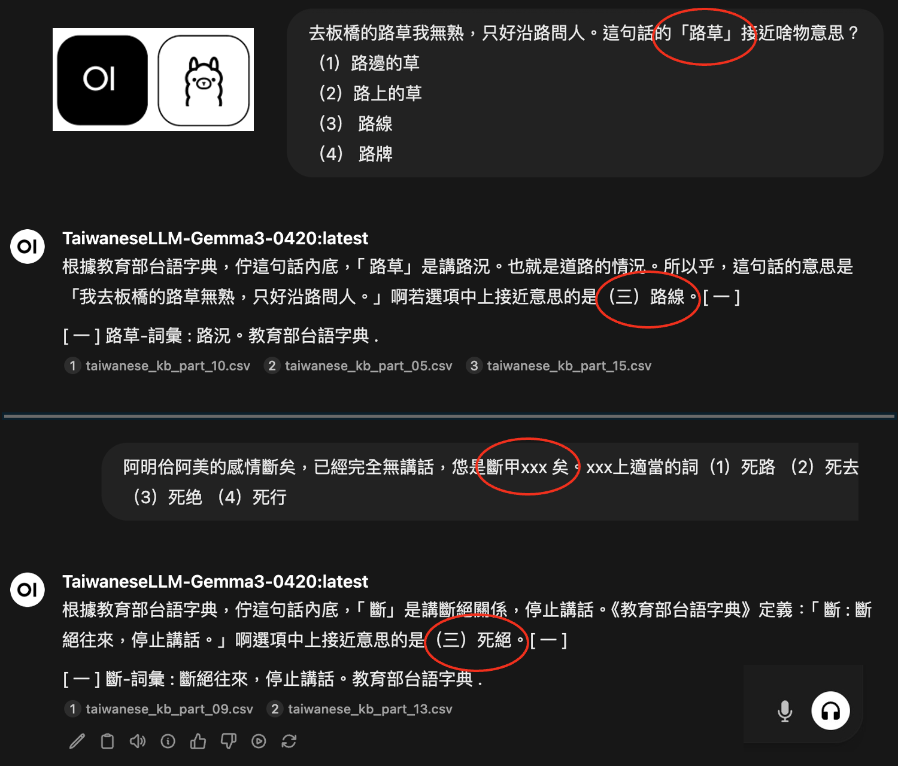
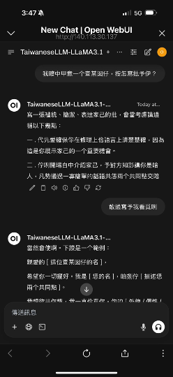
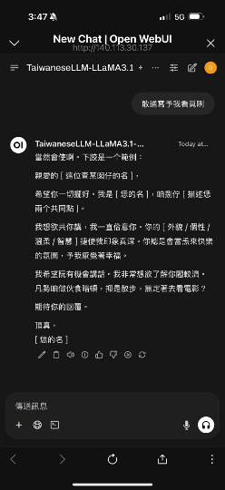
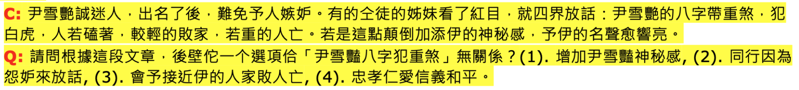

# SARC-Taigi-LLM

[](https://huggingface.co/Speech-AI-Research-Center/SARC-Taigi-LLM-27b)
[](https://huggingface.co/Speech-AI-Research-Center/SARC-Taigi-LLM-12b)
[](https://huggingface.co/datasets/IMA-Taiwan)
[](https://huggingface.co/google/gemma-3-27b-it)
[](#environment-requirements)
[](#environment-requirements)
[](#license)

SARC-Taigi-LLM is an implementation-oriented project that demonstrates how to build a **Taiwanese (Taigi) LLM** using **IMA's Taiwan Tongues Taigi datasets**. Starting from **Gemma-3-12b-it** or **Gemma-3-27b-it**, this repository shows how to inject Taigi lexical and literary knowledge, run staged adaptation, select stable checkpoints, and obtain Taigi-specialized QLoRA adapters.

---

## Table of Contents

- [Project Goal](#project-goal)
- [Demonstration](#demonstration)
- [Evaluation](#evaluation)
- [Released Models](#released-models)
- [Dataset and Data Sources](#dataset-and-data-sources)
- [Training Framework](#training-framework)
  - [Phase I: Continual Pre-Training (CPT)](#phase-i-continual-pre-training-cpt)
  - [Phase II: Supervised Fine-Tuning (SFT)](#phase-ii-supervised-fine-tuning-sft)
  - [Phase III: GRPO (Planned)](#phase-iii-grpo-planned)
- [Quick Start](#quick-start)
  - [Implementation Details](#implementation-details)
  - [Environment Requirements](#environment-requirements)
  - [Execution](#execution)
- [Citation](#citation)
- [Contact](#contact)
- [License](#license)

---

## Project Goal

The main purpose of this repository is to **show how to implement a Taigi LLM with IMA's Taiwan Tongues Taigi datasets** to support:

- **Taigi dialogue and consultation** for daily and professional interactions
- **Linguistic knowledge retrieval** for questions about Taigi vocabulary, usage, meaning, and cultural background
- **Reasoning in Taigi contexts** for Taigi-oriented linguistic and technical tasks

---

More specifically, this project demonstrates how to:

- start from a general-purpose instruction model such as **Gemma-3-12b-it** or **Gemma-3-27b-it**
- strengthen the base model with Taigi lexical and literary knowledge
- perform staged adaptation through **Continual Pre-Training (CPT)** and **Supervised Fine-Tuning (SFT)**
- apply checkpoint-selection strategies that emphasize both performance and stability
- produce a Taigi-specialized adapter that can be loaded on top of the Gemma base model

---

## Demonstration

A live demo of the released Taigi LLM is available at:

- https://llm.ivoice.tw:64441/

* QA Examples

<div style="display: flex; justify-content: center; align-items: center;">
  
  
  
</div>

---

## Evaluation

We evaluated the models on the **<<2020 Grand Challenge, Talk to AI (科技大擂台，與 AI 對話)>> Final-Test Dataset**, which contains **1,000 multiple-choice reading comprehension questions** for Taigi language understanding.

* Question Example
 

* Experimental Results

|  | Model | Accuracy | Note |
| :--- | :---: | :---: | :--- |
| Stage | Gemma-3-12b-it | Gemma-3-27b-it |  |
| **Original** | **0.80320** | **0.86214** | Baseline performance |
| **After CPT** | **0.88312** | **0.92296** | Knowledge internalization |
| **After SFT** | **0.89610** | **0.92582** | Instruction alignment |

These results suggest that CPT substantially improves Taigi knowledge acquisition, while SFT provides an additional gain through instruction alignment.

---

## Released Models

The training pipeline in this repository is used to produce the following Hugging Face releases:

- [SARC-Taigi-LLM-27b](https://huggingface.co/Speech-AI-Research-Center/SARC-Taigi-LLM-27b)
- [SARC-Taigi-LLM-12b](https://huggingface.co/Speech-AI-Research-Center/SARC-Taigi-LLM-12b)

The **27B release** is built on **`google/gemma-3-27b-it`** and released as a **QLoRA adapter** corresponding to the **CPT + SFT** stages.

---

## Dataset and Data Sources

This project is centered on **IMA's Taiwan Tongues Taigi datasets** and related Taigi resources.

The released 27B model card uses the following dataset sources:

- IMA-Taiwan/taigi-literature-ots
- IMA-Taiwan/taigi-literature-tks
- IMA-Taiwan/taigi-literature-abt
- IMA-Taiwan/taigi-literature-kkh
- IMA-Taiwan/taigi-literature-olbt
- IMA-Taiwan/taigi-literature-ljk
- IMA-Taiwan/taigi-literature-tsk
- IMA-Taiwan/taigi-literature-manlajo
- IMA-Taiwan/taigi-literature-asts
- IMA-Taiwan/taigi-literature-achiak
- IMA-Taiwan/taigi-literature-ngkh
- IMA-Taiwan/taigi-literature-ttshs
- IMA-Taiwan/taigi-literature-pikh
- IMA-Taiwan/taigi-literature-khg
- IMA-Taiwan/taigi-literature-sslts
- IMA-Taiwan/taigi-literature-lgs
- IMA-Taiwan/taigi-literature-llb

In addition to these literary corpora, the pipeline also uses:

- **Ministry of Education Dictionary of Frequently Used Taiwanese Taigi**
- Taigi-adapted instruction data
- Taigi multiple-choice reading comprehension data derived from the Grand Challenge training set

---

## Training Framework

This project follows a three-phase training framework. In the current release, **Phase I (CPT)** and **Phase II (SFT)** are implemented in unified training scripts (`cpt_sft_27b.py` and `cpt_sft_12b.py`), while **Phase III (GRPO)** remains planned future work.

### Phase I: Continual Pre-Training (CPT)
- **Goal**: Expand the base model's Taigi knowledge using lexical and literary resources.
- **Training strategy**: Uses `SaveBestCheckpointsCallback` to rank and retain checkpoints based on evaluation loss.
- **Expected effect**: Strengthens Taigi vocabulary coverage, linguistic pattern acquisition, and cultural grounding while reducing catastrophic forgetting of the base model's general capabilities.

### Phase II: Supervised Fine-Tuning (SFT)
- **Goal**: Align the model with instruction-following behavior and reasoning-oriented tasks in Taigi.
- **Training strategy**: Uses `AsyncGapMinimizationCallback` to minimize the generalization gap, defined as `|Avg(TrainLoss) - EvalLoss|`.
- **Expected effect**: Filters out overfitted checkpoints through asynchronous moving-average sampling and selects more stable models for subsequent training stages.

### Phase III: GRPO (Planned)
- **Goal**: Extend the training pipeline from supervised learning to reinforcement learning.
- **Planned direction**: Apply **GRPO (Group Relative Policy Optimization)** to improve reasoning performance on more complex Taigi linguistic tasks and technical queries.
- **Expected effect**: Improve self-correction, logical consistency, and robustness in low-resource language settings through group-relative reward optimization.

---

## Quick Start

To reproduce the training workflow, first prepare the environment and datasets, then launch the staged training script for either the 27B or 12B setting. The released Hugging Face adapters can be loaded on top of the corresponding Gemma base model for inference after training.

### Implementation Details

#### 1. Unified multi-stage workflow

The pipeline supports automatic transition between CPT and SFT. After CPT is completed, the training script identifies the top-ranked checkpoint and uses it as the initialization checkpoint for SFT.

#### 2. Principled checkpoint selection

Instead of relying only on routine step-based checkpoint saving, the pipeline evaluates checkpoints using task-relevant criteria:

- **Knowledge density** through evaluation loss during CPT
- **Generalization stability** through asynchronous gap sampling during SFT

#### 3. Smart hardware adaptation

The training scripts automatically detect the number of available GPUs via `torch.cuda.device_count()` and adjust training behavior for **DDP (Distributed Data Parallel)** execution.

Key adaptations include:

- `use_reentrant=False` to improve gradient checkpointing stability in distributed environments
- tuned `dataloader_num_workers`
- `pin_memory` optimization for improved data throughput

#### 4. Automated weight handoff

Between CPT and SFT, the pipeline performs an automatic checkpoint handoff:

1. **Rank-1 Extraction**: identifies the best checkpoint from CPT ranking results
2. **DDP Synchronization**: uses `dist.broadcast_object_list` to ensure that all GPU processes load the same checkpoint path
3. **Memory Recovery**: explicitly calls `gc.collect()` and `cuda.empty_cache()` to reduce OOM risk during large-model transition, especially for the 27B setting

#### 5. Strict checkpoint control

During SFT, the callback explicitly sets `control.should_save = False`, overriding the default `Trainer` checkpoint-saving behavior. This ensures that storage is reserved for checkpoints selected by the gap-based evaluation strategy rather than routine step-based saves.

### Environment Requirements

#### Hardware

- At least one NVIDIA GPU with **80 GB VRAM** (e.g., A100 or H100) is recommended for fine-tuning the 27B model
- Two or more GPUs are strongly recommended for faster training and larger effective batch sizes under DDP

#### Software

- Linux
- Python 3.11+
- CUDA 12.1+

#### Core libraries

- `torch`
- `transformers`
- `peft`
- `datasets`
- `bitsandbytes`
- `accelerate`
- `wandb`

Install the required packages with:

```bash
pip install torch transformers peft datasets bitsandbytes accelerate wandb
```

### Execution

The training scripts are hardware-aware and automatically adjust settings such as `use_reentrant=False`, `dataloader_num_workers`, and `pin_memory` based on the detected GPU configuration.

#### Recommended launch method: `torchrun`

Using `torchrun` is recommended to ensure correct initialization of distributed training environment variables, including `LOCAL_RANK`, and proper synchronization across all processes.

**Single-GPU**

```bash
torchrun --nproc_per_node=1 cpt_sft_27b.py
```

**Multi-GPU (DDP)**

```bash
# Example: 2 GPUs
torchrun --nproc_per_node=2 cpt_sft_27b.py
```

For the 12B version:

```bash
torchrun --nproc_per_node=1 cpt_sft_12b.py
```

---

## Citation

If you find this project useful, please cite it as:

```bibtex
@misc{sarctaigillm2026,
  title        = {SARC-Taigi-LLM: An Implementation-Oriented Training Project for Building a Taiwanese (Taigi) LLM with IMA's Taiwan Tongues Datasets},
  author       = {Speech AI Research Center (SARC)},
  year         = {2026},
  howpublished = {\url{https://github.com/Speech-AI-Research-Center/SARC-Taigi-LLM}},
  note         = {GitHub repository}
}
```

---

## Contact

For questions, collaboration, or technical discussion, please contact:

- **Speech AI Research Center (SARC)**
- **National Yang Ming Chiao Tung University (NYCU)**
- Email: `sarc@nycu.edu.tw`

You may also open an issue in this repository.

---

## License

This project and the released adapters are subject to the **Gemma Terms of Use**. By using the model or training outputs, you agree to comply with the licensing requirements associated with the Gemma base model.


